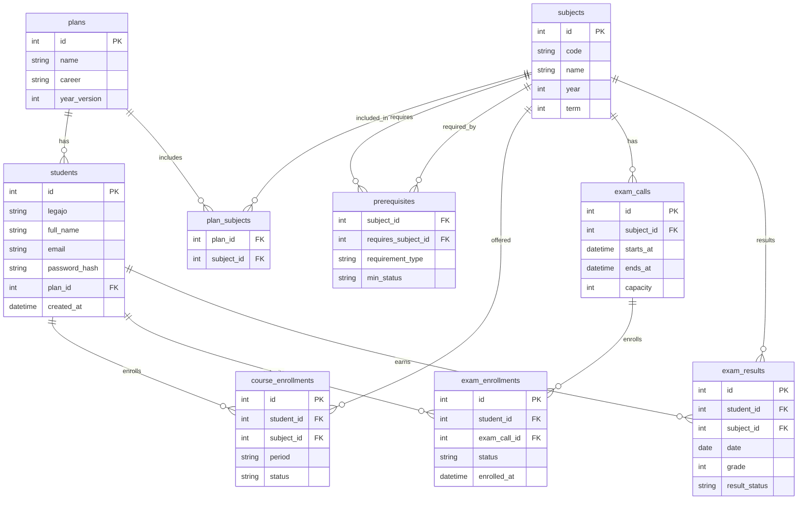

# ERD - Autogestion Alumnos (MVP)

This ERD covers the minimal schema for the MVP described in scope.md.

## Notes
- `requirement_type`: FOR_COURSE or FOR_EXAM
- `min_status`: REGULAR or APPROVED (optional)
- Suggested unique constraints:
  - students.legajo
  - students.email
  - plan_subjects (plan_id, subject_id)
  - prerequisites (subject_id, requires_subject_id, requirement_type)
  - course_enrollments (student_id, subject_id, period)
  - exam_enrollments (student_id, exam_call_id)
